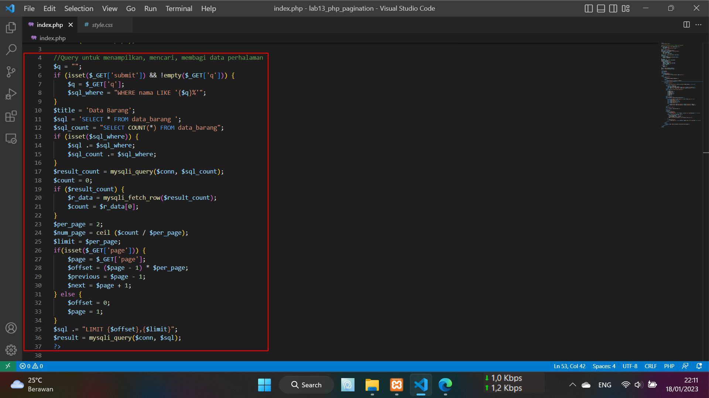
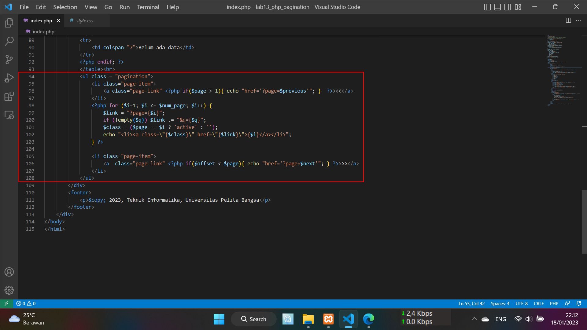
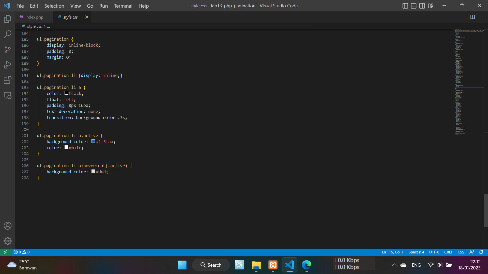
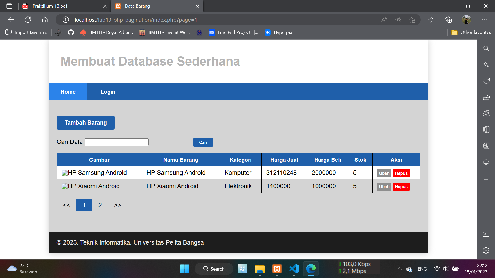

# Lab13Web
## Ananda Fachri Reynaldi
## 312110248
## TI.21.B1
<br>
<b>Membuat Pagination</b><br>

Mengubah Query dan tambahkan pagination pada Query tersebut dan<br>
dan setting perpage hanya menampilkan 2 buah data
<br>

Membuat tampilan, melengkapi pagination link previous dan next sehingga<br>
ketika diklik akan mengarah ke halaman sebelumnya atau selanjutnya
<br>

Menambahkan kode berikut pada file `style.css`<br>
<br>

Setelah itu uji coba gunakan URL :
```
http://localhost/lab13_php_pagination/index.php?page=1
```
Hasilnya :<br>
<br>